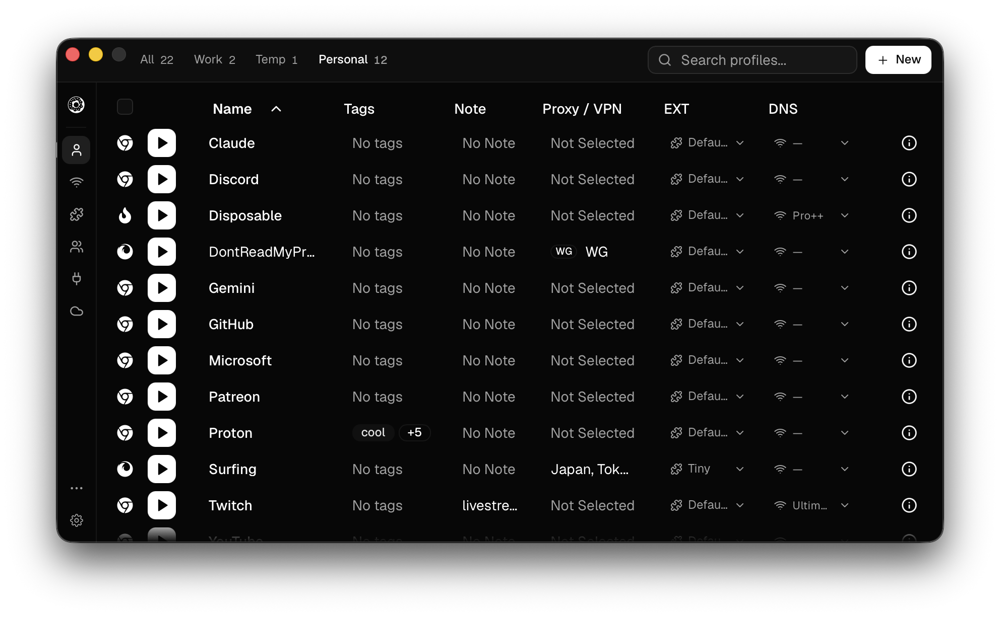

<div align="center">
  
  <h1>WaterMelon Browser</h1>
  <strong>Open Source Anti-Detect Browser</strong>
</div>
<br>

<p align="center">
  <a style="text-decoration: none;" href="https://github.com/ssjblue197/watermelonbrowser/releases/latest" target="_blank">
  </a>
  <a style="text-decoration: none;" href="https://github.com/ssjblue197/watermelonbrowser/issues" target="_blank">
    
  </a>
  <a style="text-decoration: none;" href="https://github.com/ssjblue197/watermelonbrowser/blob/main/LICENSE" target="_blank">
    
  </a>
  <a style="text-decoration: none;" href="https://github.com/ssjblue197/watermelonbrowser/network/members" target="_blank">
    
  </a>
</p>



## Features

- **Unlimited browser profiles** — each fully isolated with its own fingerprint, cookies, extensions, and data
- **Chromium & Firefox engines** — Chromium powered by [Wayfern](https://wayfern.com), Firefox powered by [Camoufox](https://camoufox.com), both with advanced fingerprint spoofing
- **DNS AdBlocker** - block ads, trackers, and other unwanted content with per-profile DNS blocking
- **Proxy support** — HTTP, HTTPS, SOCKS4, SOCKS5 per profile, with dynamic proxy URLs
- **VPN support** — WireGuard configs per profile
- **Local API & MCP** — REST API and [Model Context Protocol](https://modelcontextprotocol.io) server for integration with Claude, automation tools, and custom workflows
- **Profile groups** — organize profiles and apply bulk settings
- **Import profiles** — migrate from Chrome, Firefox, Edge, Brave, or other Chromium browsers
- **Cookie & extension management** — import/export cookies, manage extensions per profile
- **Default browser** — set WaterMelon as your default browser and choose which profile opens each link
- **Cloud sync** — sync profiles, proxies, and groups across devices (self-hostable)
- **E2E encryption** — optional end-to-end encrypted sync with a password only you know
- **Zero telemetry** — no tracking or device fingerprinting

## Install

<!-- install-links-start -->
### macOS

| | Apple Silicon | Intel |
|---|---|---|
| **DMG** | [Download](https://github.com/ssjblue197/watermelonbrowser/releases/download/v0.0.2/WaterMelon_0.0.2_aarch64.dmg) | [Download](https://github.com/ssjblue197/watermelonbrowser/releases/download/v0.0.2/WaterMelon_0.0.2_x64.dmg) |

### Windows

[Download Windows Installer (x64)](https://github.com/ssjblue197/watermelonbrowser/releases/download/v0.0.2/WaterMelon_0.0.2_x64-setup.exe) · [Portable (x64)](https://github.com/ssjblue197/watermelonbrowser/releases/download/v0.0.2/WaterMelon_0.0.2_x64-portable.zip)

### Linux

| Format | x86_64 | ARM64 |
|---|---|---|
| **deb** | [Download](https://github.com/ssjblue197/watermelonbrowser/releases/download/v0.0.2/WaterMelon_0.0.2_amd64.deb) | [Download](https://github.com/ssjblue197/watermelonbrowser/releases/download/v0.0.2/WaterMelon_0.0.2_arm64.deb) |
| **rpm** | [Download](https://github.com/ssjblue197/watermelonbrowser/releases/download/v0.0.2/WaterMelon-0.0.2-1.x86_64.rpm) | [Download](https://github.com/ssjblue197/watermelonbrowser/releases/download/v0.0.2/WaterMelon-0.0.2-1.aarch64.rpm) |
| **AppImage** | [Download](https://github.com/ssjblue197/watermelonbrowser/releases/download/v0.0.2/WaterMelon_0.0.2_amd64.AppImage) | [Download](https://github.com/ssjblue197/watermelonbrowser/releases/download/v0.0.2/WaterMelon_0.0.2_aarch64.AppImage) |
<!-- install-links-end -->

<details>
<summary>Troubleshooting AppImage</summary>

If the AppImage segfaults on launch, install **libfuse2** (`sudo apt install libfuse2` / `yay -S libfuse2` / `sudo dnf install fuse-libs`), or bypass FUSE entirely:

```bash
APPIMAGE_EXTRACT_AND_RUN=1 ./WaterMelon.Browser_x.x.x_amd64.AppImage
```

If that gives an EGL display error, try adding `WEBKIT_DISABLE_DMABUF_RENDERER=1` or `GDK_BACKEND=x11` to the command above. If issues persist, the **.deb** / **.rpm** packages are a more reliable alternative.

</details>

### Nix

```bash
nix run github:ssjblue197/watermelonbrowser#release-start
```

## Self-Hosting Sync

WaterMelon Browser supports syncing profiles, proxies, and groups across devices via a self-hosted sync server. See the [Self-Hosting Guide](docs/self-hosting-watermelon-sync.md) for Docker-based setup instructions.

## Community

- **Issues**: [GitHub Issues](https://github.com/ssjblue197/watermelonbrowser/issues)
- **Discussions**: [GitHub Discussions](https://github.com/ssjblue197/watermelonbrowser/discussions)

## Star History

<a href="https://www.star-history.com/?repos=ssjblue197%2Fwatermelonbrowser&type=date&legend=top-left">
 <picture>
   <source media="(prefers-color-scheme: dark)" srcset="https://api.star-history.com/image?repos=ssjblue197/watermelonbrowser&type=date&theme=dark&legend=top-left" />
   <source media="(prefers-color-scheme: light)" srcset="https://api.star-history.com/image?repos=ssjblue197/watermelonbrowser&type=date&legend=top-left" />
   
 </picture>
</a>

## License

This project is licensed under the AGPL-3.0 License - see the [LICENSE](LICENSE) file for details.
